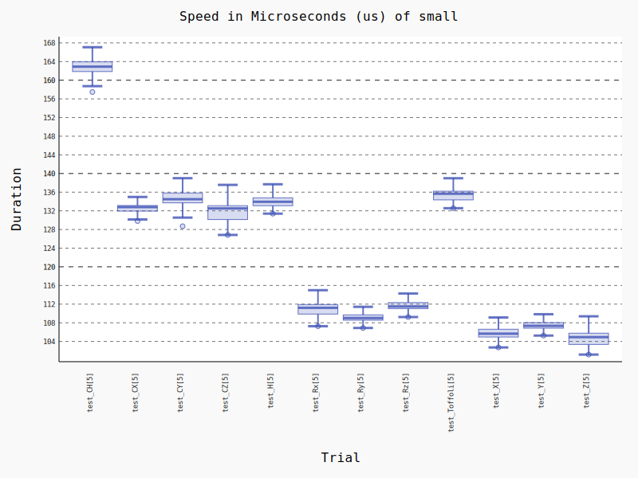
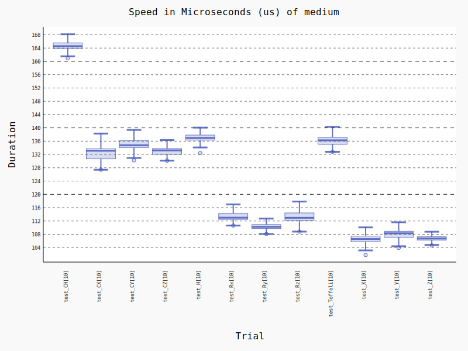
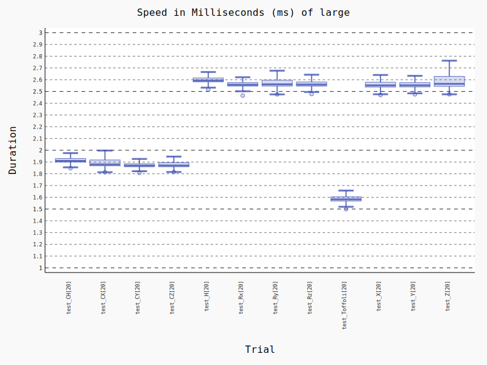

# ProjectQ benchmark
## CPU info:
架构：           x86_64
CPU 运行模式：   32-bit, 64-bit
字节序：         Little Endian
CPU:             4
在线 CPU 列表：  0-3
每个核的线程数： 2
每个座的核数：   2
座：             1
NUMA 节点：      1
厂商 ID：        GenuineIntel
CPU 系列：       6
型号：           142
型号名称：       Intel(R) Core(TM) i5-7200U CPU @ 2.50GHz
步进：           9
CPU MHz：        830.733
CPU 最大 MHz：   3100.0000
CPU 最小 MHz：   400.0000
BogoMIPS：       5424.00
虚拟化：         VT-x
L1d 缓存：       32K
L1i 缓存：       32K
L2 缓存：        256K
L3 缓存：        3072K
NUMA 节点0 CPU： 0-3
标记：           fpu vme de pse tsc msr pae mce cx8 apic sep mtrr pge mca cmov pat pse36 clflush dts acpi mmx fxsr sse sse2 ss ht tm pbe syscall nx pdpe1gb rdtscp lm constant_tsc art arch_perfmon pebs bts rep_good nopl xtopology nonstop_tsc cpuid aperfmperf tsc_known_freq pni pclmulqdq dtes64 monitor ds_cpl vmx est tm2 ssse3 sdbg fma cx16 xtpr pdcm pcid sse4_1 sse4_2 x2apic movbe popcnt tsc_deadline_timer aes xsave avx f16c rdrand lahf_lm abm 3dnowprefetch cpuid_fault epb invpcid_single pti ssbd ibrs ibpb stibp tpr_shadow vnmi flexpriority ept vpid fsgsbase tsc_adjust bmi1 avx2 smep bmi2 erms invpcid mpx rdseed adx smap clflushopt intel_pt xsaveopt xsavec xgetbv1 xsaves dtherm ida arat pln pts hwp hwp_notify hwp_act_window hwp_epp md_clear flush_l1d

# Res
## Small size (5 qubit)

## Medium Size (10 qubit)

## Large Size (20 qubit)

